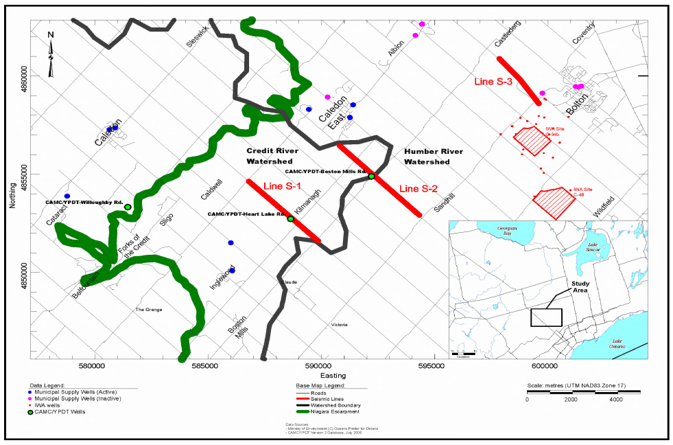
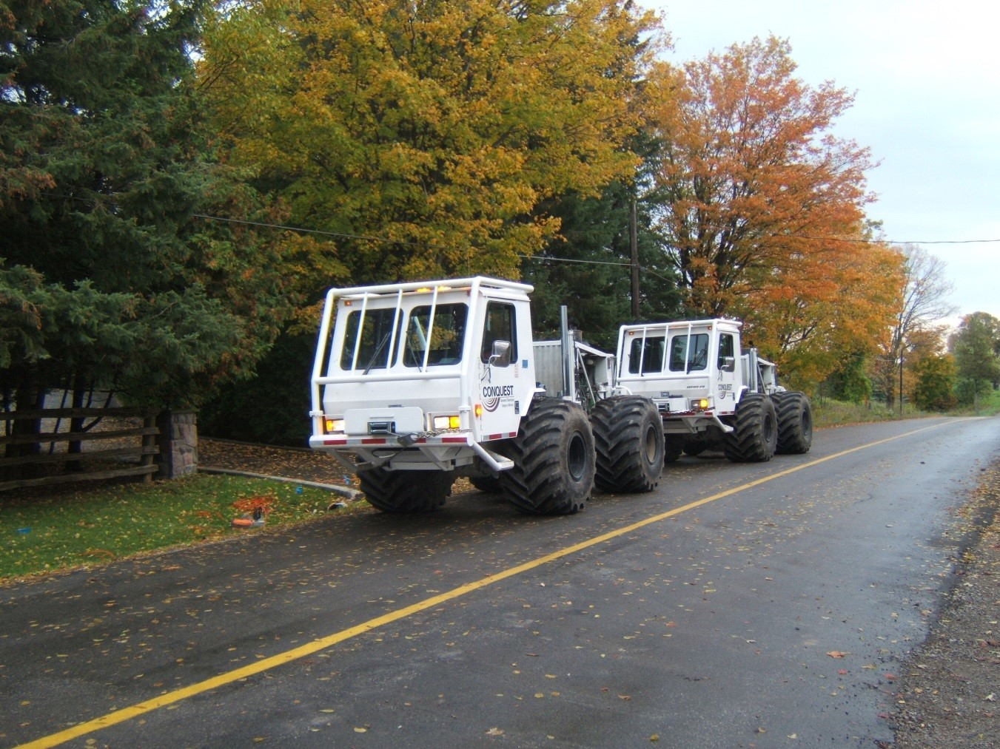
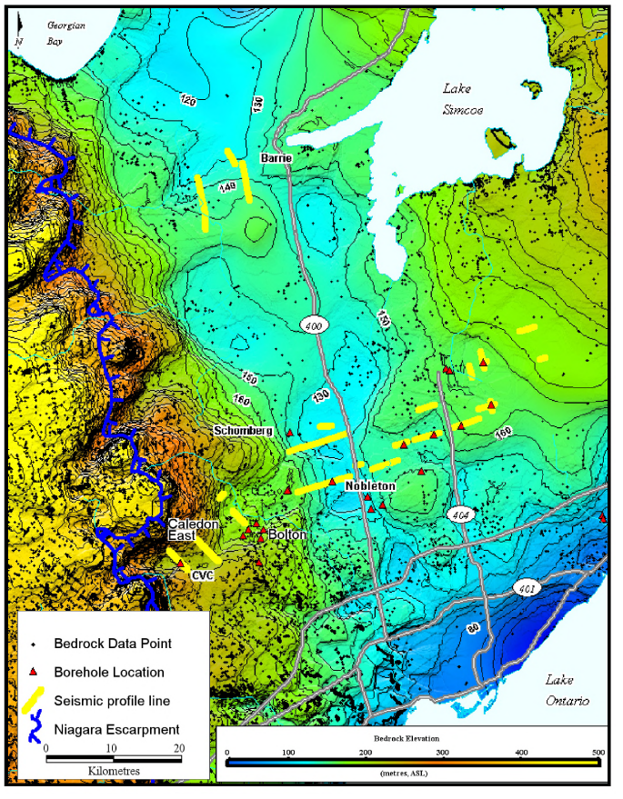
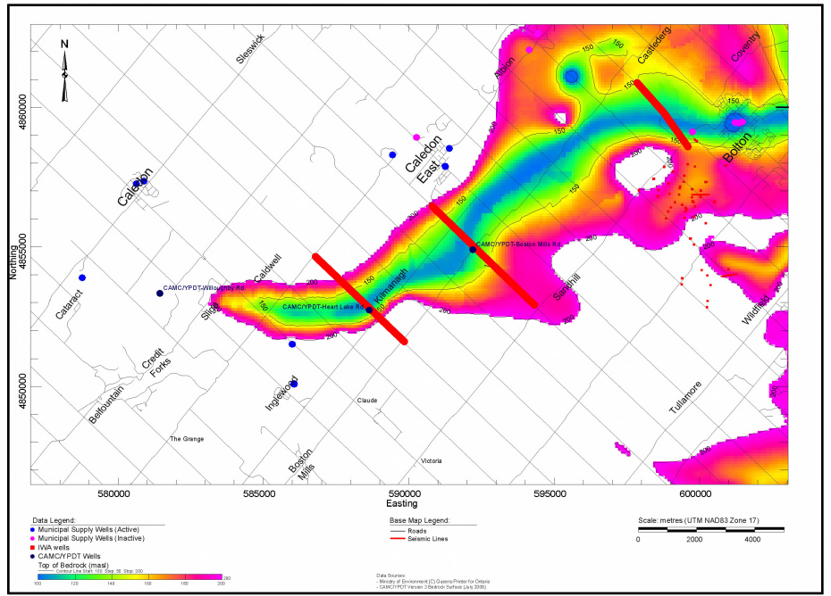
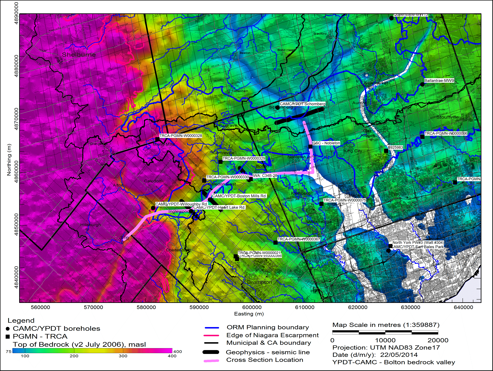

# Introduction
Construction of aquifer and aquitard layers geometry was one of the most challenging aspects of this study. Simple interpolation of sparse point data (well picks) rarely produces layer surfaces that realistically represent the structure and continuity of complex hydrogeologic features such as channel and valley systems. To fully represent the complexity of the aquifers and aquitards in the Oak Ridges Moraine area, borehole lithology picks were supplemented with information obtained from, subtle hydrogeologic indicators (such as well screen placement and well depth) as well as from expert intuition and geologic conceptual understanding of the
sedimentological processes. This information was integrated into the model construction
process using 3-D polylines to constrain the interpolation processes.
Database integration, data flexible visualization, efficient layer picking tools, and geostatistical
analysis functions provided by the VIEWLOG software made it possible to review and
synthesize the large amounts of borehole data (discussed further below). The resulting
hydrostratigraphic model not only honoured the borehole and well data, but also encapsulated
the conceptual understanding of the processes that formed the Oak Ridges Moraine.

# Documents

_Figure 3: Boston-Mills borehole location_

_Figure 4: Seismic reflection survey being conducted along Airport Road_

_Figure 5: Interpreted regional bedrock topography. Blue shading delineates the interpreted Laurentian valley. Figure from Davies et al.2008_

_Figure 6: Interpreted local bedrock topography. Figure from Davies et al. 2008_

_Figure 7: Cross section location along Caledon East buried bedrock valley_

_Figure 8: West-East cross section along the Caledon East buried bedrock valley showing interpreted thickness of basal channel aquifer (shown as Scarborough aquifer complex.)_

[^1].

[^2].  

[^1]: Spencer, J.W. 1890.  Origin of the basins of the Great Lakes of America.  American Geologist, 7, 86-97.​
[^2]: Spencer, J.W. 1881.  Discovery of the preglacial outlet of the basin of Lake Erie into that of Lake Ontario.  Canadian Naturalist, 10, 65-79.​
