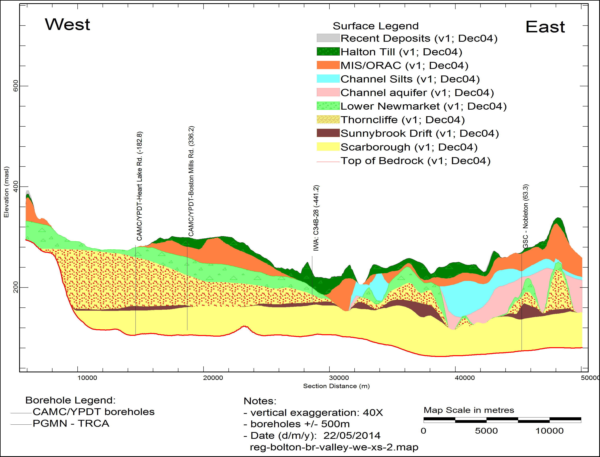

# Introduction
Construction of aquifer and aquitard layers geometry was one of the most challenging aspects of this study. Simple interpolation of sparse point data (well picks) rarely produces layer surfaces that realistically represent the structure and continuity of complex hydrogeologic features such as channel and valley systems. To fully represent the complexity of the aquifers and aquitards in the Oak Ridges Moraine area, borehole lithology picks were supplemented with information obtained from, subtle hydrogeologic indicators (such as well screen placement and well depth) as well as from expert intuition and geologic conceptual understanding of the sedimentological processes. This information was integrated into the model construction process using 3-D polylines to constrain the interpolation processes.

Database integration, data flexible visualization, efficient layer picking tools, and geostatistical analysis functions provided by the VIEWLOG software made it possible to review and synthesize the large amounts of borehole data (discussed further below). The resulting hydrostratigraphic model not only honoured the borehole and well data, but also encapsulated the conceptual understanding of the processes that formed the Oak Ridges Moraine.

# Data Correction and Data Biases
Ontario Ministry of Environment driller’s logs form the majority of the borehole information in the database. The accuracy and reliability of individual wells in this data set is sometimes questionable, however, the logs provide a significant amount of useful subsurface information. Care was taken to screen the data visually and correct for obvious or known errors, thereby minimizing the intrinsic biases in the driller’s logs.

ome of the location and elevation errors in the MOE’s database were addressed through field validation (using GPS) of over 5,000 of the wells which had not previously been located (Beatty and Associates 2003). Borehole elevations were compared against, and adjusted to the high resolution DEM (10 m cell size) to minimize elevation errors. Highly erroneous or unreliable wells (MOE quality code greater than 6) were excluded from the analysis.

Water well records in the western Oak Ridges Moraine were compared against detailed core logging from geotechnical, hydrogeological and sedimentologically-logged boreholes (Sharpe et al., 2002). Logan et al. (2001) showed the value of using these high-quality records to “train’ the well records (e.g. Logan et al., 2001). Thus, higher quality “golden spike” wells and seismic picks were used extensively during layer refinement. The high quality “golden spike” wells, seismic picks, and outcrop data (as well as any other higher quality data) were identified (and given greater weight) using a variety of qualitative measures. Well ownership was also examined and any wells drilled by a consultant or for a municipality were assumed to be of higher quality and were given more weight in the interpretation. Frequently, wells with poorer or better quality information could be readily identified by visually comparing clusters of wells on cross section (e.g. poorer wells would have a single geological description through the entire depth of the well).

A standardized scheme to re-code driller’s log descriptions was developed by three GSC geologists for the Oak Ridges Moraine area (Russell et al., 1998). Re-coded lithologic information helped identify drillers’ tendencies in reporting data but could not be relied upon without referring to the high-quality data. A significant bias was the use of the term “clay” by the water well drillers. In reality, analysis suggested that reported “clay“ material was more likely to be silt or fine sand. Similarly, drillers rarely use the term till but use terms such as “hardpan” or “hard” or report occurrences of “clay gravel”. Re-coded lithologic log information was displayed on cross section during interpretation and picking, however, presentation of the original (un-coded) raw MOE lithologic descriptions was still considered essential to the identification of unit boundaries and key indicator patterns.

Other percieved biases and patterns were identified during the geological surface refinement process. As most drillers are hired simply to “find water”, they frequently stop drilling as soon as they encounter a significant aquifer zone. Since tapping into the top few metres of a significant aquifer is all that is necessary to meet the needs of most domestic well owners, very little of the permeable aquifer material is sampled and documented within the driller’s logs. As a result, the majority of driller’s logs are typically a record of aquitard materials, with only the bottom-most screened sand or gravel unit representative of aquifer material. Despite these biases, highly significant patterns were identified within the logs, as discussed in the following sections.

_Figure 8: West-East cross section along the Caledon East buried bedrock valley showing interpreted thickness of basal channel aquifer (shown as Scarborough aquifer complex.)_

[^1].

[^2].  

[^1]: Spencer, J.W. 1890.  Origin of the basins of the Great Lakes of America.  American Geologist, 7, 86-97.​
[^2]: Spencer, J.W. 1881.  Discovery of the preglacial outlet of the basin of Lake Erie into that of Lake Ontario.  Canadian Naturalist, 10, 65-79.​
